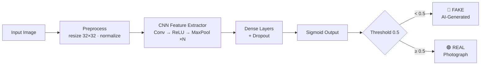

<div align="center">

#  CIFAKE — *Can You Trust Your Eyes?*

### Real photograph or AI hallucination? This model calls the bluff in milliseconds. 

```
   ██████╗ ██╗███████╗ █████╗ ██╗  ██╗███████╗
  ██╔════╝ ██║██╔════╝██╔══██╗██║ ██╔╝██╔════╝
  ██║      ██║█████╗  ███████║█████╔╝ █████╗  
  ██║      ██║██╔══╝  ██╔══██║██╔═██╗ ██╔══╝  
  ╚██████╗ ██║██║     ██║  ██║██║  ██╗███████╗
   ╚═════╝ ╚═╝╚═╝     ╚═╝  ╚═╝╚═╝  ╚═╝╚══════╝
        REAL  vs  AI-GENERATED  •  DETECTOR
```

[](https://cifakee.streamlit.app/)
[](https://github.com/Alok-0601/CIFAKE)


**[ Live App](https://cifakee.streamlit.app/) · [ How it works](#-how-it-works) · [Quickstart](#️-quickstart-60-seconds) · [Results](#-results) · [ Roadmap](#️-roadmap)**

</div>

---

## The Problem

> In 2023, a fake AI image of an explosion near the Pentagon wiped billions off the stock market for a few minutes.
> Humans looked. Humans believed. Humans were wrong.

Diffusion models can now produce images so convincing that **our eyes are officially unreliable witnesses**.
So we stopped trusting eyes and trained a **Convolutional Neural Network** instead.

**CIFAKE** is a deep-learning powered detector that takes any image and answers one deceptively simple question:

<div align="center">

###  `REAL` &nbsp;&nbsp;&nbsp; or &nbsp;&nbsp;&nbsp;  `AI-GENERATED`

</div>

---

##  Try It Right Now (no install, no excuses)

<div align="center">

###  **[cifakee.streamlit.app](https://cifakee.streamlit.app/)** 

</div>

1. Open the app 
2. Drag & drop any image 
3. Watch the model deliver its verdict + confidence score in real time 

---

##  How It Works



### The plot twist

The fascinating part of this problem: **the model barely cares about the subject of the photo.**
Research on this dataset shows detectors latch onto **tiny statistical fingerprints in the background** — micro-textures, unnatural smoothness and frequency artifacts that diffusion models leave behind like digital fingerprints at a crime scene. 

The cat is not the clue. The *air around the cat* is the clue.

---
## The Dataset — CIFAKE

| | |
|---|---|
|  **REAL images** | 60,000 — sourced from the classic **CIFAR-10** dataset |
|  **FAKE images** | 60,000 — generated with **Stable Diffusion v1.4**, mirroring CIFAR-10's 10 classes |
|  **Total** | **120,000** images |
|  **Train / Test** | 100,000 / 20,000 (perfectly balanced, 50/50 per class) |
|  **Resolution** | 32 × 32 RGB |
|  **Classes covered** | airplane, automobile, bird, cat, deer, dog, frog, horse, ship, truck |

 **Download:** [CIFAKE on Kaggle](https://www.kaggle.com/datasets/birdy654/cifake-real-and-ai-generated-synthetic-images)
 **Original paper:** Bird, J.J. & Lotfi, A. (2024). *CIFAKE: Image Classification and Explainable Identification of AI-Generated Synthetic Images*, **IEEE Access** — [arXiv:2303.14126](https://arxiv.org/abs/2303.14126)

>  The dataset is **not** committed to this repo (120k images ). Download it from Kaggle and drop it into `data/`.

---

## Quickstart (60 seconds)

```bash
#  Clone the repo
git clone https://github.com/Alok-0601/CIFAKE.git
cd CIFAKE

#  Create a virtual environment
python -m venv venv
source venv/bin/activate        # Windows: venv\Scripts\activate

#  Install the dependencies
pip install -r requirements.txt

# Launch the app 
streamlit run app.py
```

Then open **http://localhost:8501** and start busting fakes. 

>  Using the dataset locally? Expected layout:
>
> ```
> data/
> ├── train/
> │   ├── REAL/
> │   └── FAKE/
> └── test/
>     ├── REAL/
>     └── FAKE/
> ```

---

## Project Structure

```
CIFAKE/
├──  app.py                  # Streamlit web app (the pretty face)
├── model/                  # Trained model weights (.h5 / .keras)
├──  notebooks/              # Training, EDA & evaluation notebooks
├──  data/                   # CIFAKE dataset (git-ignored — grab it from Kaggle)
├──  requirements.txt        # Dependencies
└──  README.md               # You are here 
```

---

## Results

| Metric | Score |
|---|---|
|  Accuracy | `~96%` |
|  Precision | `~95%` |
|  Recall | `~94%` |
|  F1-Score | `~95%` |
|  Inference time | `< 1s` per image |

<!--  Swap these in with your actual numbers from the evaluation notebook to make the flex official. -->

**Training setup:** binary cross-entropy loss · Adam optimizer · dropout regularization · early stopping on validation loss.

---

## Tech Stack

<div align="center">


</div>

---

## 🗺️ Roadmap

- [x]  Preprocessing pipeline for 120k images
- [x]  CNN classifier trained on CIFAKE
- [x]  Streamlit web app
- [x]  Deploy to Streamlit Community Cloud
- [ ]  Grad-CAM heatmaps — *show* which pixels snitched
- [ ] Transfer learning (ResNet / EfficientNet / ViT) showdown
- [ ] Support for high-resolution & modern generators (SDXL, Midjourney, DALL·E 3)
- [ ]  Batch upload + downloadable CSV report
- [ ]  REST API endpoint (FastAPI)
- [ ]  Browser extension: flag AI images while you scroll

---

##  Contributing

Pull requests are extremely welcome. 

```bash
git checkout -b feature/your-amazing-idea
git commit -m "feat: add your amazing idea"
git push origin feature/your-amazing-idea
```

Then open a PR. Found a bug or have an idea? [Open an issue](https://github.com/Alok-0601/CIFAKE/issues) 🐛

---

## Honest Disclaimer

This model was trained on **32×32 CIFAR-style images generated by Stable Diffusion v1.4**.
It is a research & learning project — **not** a forensic tool. Newer generators, heavy compression, screenshots and out-of-distribution images can and will fool it. Please don't use it to win arguments on the internet. 

---

##  Acknowledgements

- **Dr. Jordan J. Bird** & **Prof. Ahmad Lotfi** (Nottingham Trent University) — creators of the CIFAKE dataset 
- **Alex Krizhevsky et al.** — the CIFAR-10 dataset 
- **Stability AI / CompVis** — Stable Diffusion v1.4 
- **Streamlit** — for making ML demos fun again 

---

##  License

Released under the **MIT License** — free to use, fork, remix and learn from. See [`LICENSE`](LICENSE) for details.

---

<div align="center">

### Built with ,  and a healthy distrust of the internet

**by [Alok Gupta](https://github.com/Alok-0601)**

**If this project made you look twice at an image, drop a star!** 

[](https://github.com/Alok-0601/CIFAKE)

*Seeing is no longer believing. *

</div>
